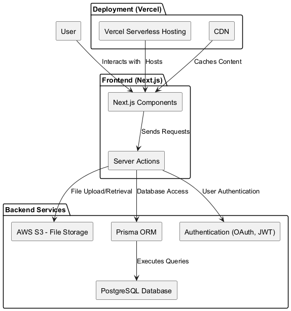

# Software Design Document

## Table of Contents

1. [Introduction](#1-introduction)
   1. [Objective](#11-objective)
   2. [Scope](#12-scope)
   3. [Glossary](#13-glossary)
   4. [References](#14-references)
2. [Overall Description](#2-overall-description)
   1. [General Overview](#21-general-overview)
   2. [Assumptions/Constraints/Risks](#22-assumptionsconstraintsrisks)
      1. [Assumptions](#221-assumptions)
      2. [Constraints](#222-constraints)
      3. [Risks](#223-risks)
3. [System Architecture and Architecture Design](#3-system-architecture-and-architecture-design)
   1. [Architectural Patterns](#31-architectural-patterns)
   2. [Interaction Diagrams](#32-interaction-diagrams)
   3. [Analysis Class Diagrams](#33-analysis-class-diagrams)
   4. [Unified Analysis Class Diagram](#34-unified-analysis-class-diagram)
   5. [Security Software Architecture](#35-security-software-architecture)
4. [Detailed Design](#4-detailed-design)
   1. [User Interface Design](#41-user-interface-design)
      1. [Screen Configuration Standardization](#411-screen-configuration-standardization)
      2. [Screen Transition Diagrams](#412-screen-transition-diagrams)
      3. [Screen Specifications](#413-screen-specifications)
   2. [Data Modeling](#42-data-modeling)
      1. [Conceptual Data Modeling](#421-conceptual-data-modeling)
      2. [Database Design](#422-database-design)
         1. [Database Management System](#4221-database-management-system)
         2. [Database Diagram](#4222-database-diagram)
         3. [Database Detail Design](#4223-database-detail-design)
   3. [Non-Database Management System Files](#43-non-database-management-system-files)
   4. [Class Design](#44-class-design)
      1. [General Class Diagram](#441-general-class-diagram)
      2. [Class Diagrams](#442-class-diagrams)
      3. [Class Design](#443-class-design)
5. [Design Considerations](#5-design-considerations)
   1. [Goals and Guidelines](#51-goals-and-guidelines)
   2. [Architectural Strategies](#52-architectural-strategies)
   3. [Coupling and Cohesion](#53-coupling-and-cohesion)
   4. [Design Principles](#54-design-principles)
   5. [Design Patterns](#55-design-patterns)

---

## 1 Introduction

### 1.1 Objective

The objective of this Software Design Document (SDD) is to provide a comprehensive and detailed description of the software design for the JAMC (Just A Minor Change) project. This document serves as a blueprint for the development process, ensuring that the software meets the specified requirements and adheres to best practices in software design and architecture.

This document is intended for:

    Myself (the developer) as a reference during the development process.
    Instructors or mentors who require insight into the design for evaluation purposes.

### 1.2 Scope

The JAMC project is a personal web-based educational platform designed to facilitate personalized learning for high school students in Vietnam. The platform enables teachers to create and manage courses, lessons, and educational resources, while students can enroll in courses, track their progress, and engage in discussions through the Q&A module.

This SDD covers:

    The overall design of the JAMC platform, including system architecture and module decomposition.
    Detailed designs for user interfaces, data models, class structures, and security mechanisms.
    Design considerations such as goals, guidelines, architectural strategies, coupling and cohesion, design principles, and design patterns.

### 1.3 Glossary

    AWS S3: Amazon Web Services Simple Storage Service, used for file storage.
    CDN: Content Delivery Network, a system of distributed servers that deliver web content to users.
    Component-Based Architecture: An architectural style that focuses on building software from reusable components.
    CRUD: Create, Read, Update, Delete; basic operations for data manipulation.
    JWT: JSON Web Token, a compact token format used for secure data transmission.
    Next.js: A React framework for building server-side rendered and statically generated web applications.
    OAuth: An open standard for access delegation, commonly used for token-based authentication.
    Prisma: An ORM (Object-Relational Mapping) tool for Node.js and TypeScript.
    RBAC: Role-Based Access Control, a method of regulating access based on user roles.
    React: A JavaScript library for building user interfaces.
    SSR: Server-Side Rendering.
    SSG: Static Site Generation.
    TLS: Transport Layer Security, a cryptographic protocol for secure communications.
    UI: User Interface.

### 1.4 References

    Centers for Medicare & Medicaid Services, "System Design Document Template," [Online]. Available: CMS SDD Template.
    Software Requirements Specification (SRS) for JAMC Project.
    Business Requirements Document (BRD) for JAMC Project.
    Next.js Documentation: https://nextjs.org/docs.
    React Documentation: https://reactjs.org/docs.
    Prisma Documentation: https://www.prisma.io/docs.

---

## 2 Overall Description

### 2.1 General Overview

The **JAMC** platform aims to provide an interactive and personalized learning environment for high school students. It allows teachers to create and manage courses, lessons, and educational resources, while students can enroll in courses, track their progress, and engage in discussions through the Q&A module.

**System and Software Architectures:**

- **Frontend:** Built using **Next.js** and **React**, leveraging component-based architecture for modularity and reusability.
- **Backend:** Utilizes **Server Actions** in Next.js for server-side logic, with **Prisma ORM** for database interactions.
- **Database:** **PostgreSQL** database managed through **Prisma ORM**.
- **Deployment:** Hosted on **Vercel**, optimized for Next.js applications.
- **File Storage:** Uses **AWS S3** for storing uploaded files.

**Design Goals:**

- **Modularity:** Separation of concerns through reusable components and services.
- **Scalability:** Ability to handle increasing numbers of users and data.
- **Security:** Implementation of robust authentication and authorization mechanisms.
- **Performance:** Optimization through SSR/SSG and efficient data fetching.
- **Usability:** Intuitive and accessible user interfaces.

### 2.2 Assumptions/Constraints/Risks

#### 2.2.1 Assumptions

- **User Access:** Users have access to modern web browsers and stable internet connections.
- **Digital Literacy:** Users possess basic digital skills to navigate the platform.
- **Technical Proficiency:** I have sufficient knowledge in Next.js, React, and Prisma to develop and maintain the project.

#### 2.2.2 Constraints

- **Time Constraints:** As a personal project, time management is crucial to complete the project within the desired timeframe.
- **Regulatory Compliance:** Must adhere to Vietnamese data protection laws and GDPR.
- **Technology Stack Limitations:** Restricted to Next.js, PostgreSQL, and Prisma ORM.
- **Deployment Platform:** Use Vercel Platform for deployment due to optimization with Next.js.
- **Third-Party Dependencies:** Reliance on OAuth providers (Google, Facebook) and AWS S3 for file storage.

#### 2.2.3 Risks

- **Security Risks:** Potential for data breaches if security measures are insufficient.

  - _Mitigation:_ Implement robust security protocols and regular audits.

- **Scalability Risks:** High user load may impact performance.

  - _Mitigation:_ Optimize code for performance and consider scalable solutions if user base grows.

- **Dependency Risks:** Outages or changes in third-party services (e.g., AWS S3, OAuth providers).

  - _Mitigation:_ Implement fallback mechanisms and monitor service statuses.

- **Data Loss Risks:** Potential loss of data due to system failures.

  - _Mitigation:_ Regular backups and database redundancy.

---

## 3 System Architecture and Architecture Design

### 3.1 Architectural Patterns

#### Chosen Architectural Patterns

1. **Component-Based Architecture**

   - **Description:**

     - The application is constructed using reusable components that encapsulate their own logic, state, and rendering.
     - Components are the fundamental building blocks, allowing for modular and maintainable code.

   - **Reason for Choice:**

     - Aligns with React and Next.js methodologies.
     - Facilitates reusability and easier testing.
     - Enhances maintainability and scalability.

2. **Serverless Architecture**

   - **Description:**

     - Utilizes Next.js **Server Actions** for backend logic.
     - Code executes in response to events without managing server infrastructure.

   - **Reason for Choice:**

     - Simplifies deployment and scaling.
     - Reduces operational overhead.
     - Leverages cloud services effectively.

3. **Middleware Pattern**

   - **Description:**

     - Middleware functions process requests before reaching final handlers.
     - Used for authentication, authorization, logging, and validation.

   - **Reason for Choice:**

     - Centralizes common functionality.
     - Enhances security and consistency.
     - Reduces code duplication.

### 3.2 Interaction Diagrams

The sequence diagrams for key system interactions are defined in the Software Requirements Specification (Srs.md) document under section 3.2.

### 3.3 Architecture Design Diagram

### 3.4 Analysis Class Diagrams

_Placeholder for Analysis Class Diagrams_

#### 3.4.1 User Management Module

- **Components:**

  - `UserComponent`
  - `ProfileComponent`
  - `AuthenticationService`
  - `AuthorizationService`
  - `AuthenticatorComponent`

- _[Diagram to be added]_

#### 3.4.2 Course Management Module

- **Components:**

  - `CourseComponent`
  - `LessonComponent`
  - `EnrollmentComponent`
  - `ProgressComponent`
  - `CourseService`

- _[Diagram to be added]_

#### 3.4.3 Q&A Module

- **Components:**

  - `QuestionComponent`
  - `AnswerComponent`
  - `CommentComponent`
  - `VoteComponent`
  - `QnAService`

- _[Diagram to be added]_

### 3.5 Unified Analysis Class Diagram

_Placeholder for Unified Analysis Class Diagram_

- **Description:** Combines all components and services from individual modules, showing relationships and interactions.

- _[Diagram to be added]_

### 3.6 Security Software Architecture

#### 3.6.1 Authentication

- **Mechanisms Used:**

  - **OAuth 2.0 Integration** with Auth.js.
  - **Email/Password Authentication** with secure password storage (bcrypt).
  - **Multi-Factor Authentication (MFA)** for enhanced security.

- **Components:**

  - `AuthenticationService`
  - `AuthenticatorComponent`
  - `SessionManagement`

#### 3.6.2 Authorization

- **Role-Based Access Control (RBAC):**

  - **Roles:**

    - `ONBOARDING`, `STUDENT`, `TEACHER`, `ADMIN`.

  - **Permissions:**

    - Managed by `AuthorizationService`.
    - Enforced via middleware and component-level checks.

#### 3.6.3 Encryption Protocol

- **Data in Transit:**

  - TLS/HTTPS encryption for all client-server communications.

- **Data at Rest:**

  - Encryption of sensitive data in the database.
  - Secure storage on AWS S3 with pre-signed URLs and access policies.

#### 3.6.4 Logging and Auditing Design

- **Activity Logging:**

  - Logs critical actions like authentication attempts and data modifications.

- **Auditing:**

  - Regular review of logs for compliance and security monitoring.

#### 3.6.5 Security Measures Summary

- **Secure Coding Practices:**

  - Input validation and sanitization.
  - Use of environment variables for sensitive data.

- **Regular Updates:**

  - Keeping dependencies and libraries up to date.

- **Incident Response Plan:**

  - Procedures for handling security incidents.

---

## 4 Detailed Design

### 4.1 User Interface Design

#### 4.1.1 Screen Configuration Standardization

- **Layout Consistency:**

  - Standardized header and footer across all pages.
  - Sidebar navigation on dashboard and course pages.

- **Responsive Design:**

  - Mobile-first approach ensuring compatibility across devices.

- **Accessibility:**

  - ARIA labels and semantic HTML for screen readers.
  - Keyboard navigation support.

#### 4.1.2 Screen Transition Diagrams

- **Diagram Descriptions:**

  - **User Flow Diagram:** Illustrates user navigation from login to dashboard and other modules.

  - **Course Enrollment Flow:** Shows steps from browsing courses to enrollment confirmation.

- _[Diagrams to be added]_

#### 4.1.3 Screen Specifications

_Include screen images and descriptions_

- **Login Screen:**

  - Fields: Email, Password.

  - Buttons: Login, OAuth Login Options.

- **Dashboard:**

  - Sections: Enrolled Courses, Notifications, Progress Overview.

- **Course Page:**

  - Information: Course Details, Lessons List, Instructor Info.

- **Q&A Page:**

  - Features: Question List, Search Bar, Ask Question Button.

### 4.2 Data Modeling

#### 4.2.1 Conceptual Data Modeling

_Placeholder for E-R Diagram_

- **Entities:**

  - `User`, `Course`, `Lesson`, `Enrollment`, `Question`, `Answer`, `Group`, `Revenue`.

- **Relationships:**

  - Users enroll in courses.

  - Courses contain lessons.

  - Users ask questions and provide answers.

- _[E-R Diagram to be added]_

#### 4.2.2 Database Design

##### 4.2.2.1 Database Management System

- **Chosen DBMS:** PostgreSQL

- **Description:**

  - Open-source relational database.

  - Supports complex queries and transactions.

  - Integrates well with Prisma ORM.

##### 4.2.2.2 Database Diagram

**Simplified Database Schema Diagram**

**Detailed Database Schema Diagram**

##### 4.2.2.3 Database Detail Design

_Placeholder for Database Detail Design_

### 4.3 Component Design

_Placeholder for Component Design_

## 5 Design Considerations

### 5.1 Goals and Guidelines

    Modularity: Design components to be reusable and independent. For example, the AuthenticationService and UserComponent are modular and can be reused across different pages.
    Scalability: Ensure the system can handle increased load by using component-based design, code splitting, and lazy loading to optimize rendering.
    Maintainability: Write clean, well-documented code following React best practices.
    User Experience: Prioritize intuitive interfaces; for instance, use consistent navigation across all pages.

### 5.2 Architectural Strategies

- **Technology Choice:**
        Next.js and React for the frontend, supporting server-side rendering (SSR) and static site generation (SSG).
        Prisma ORM for database interactions with PostgreSQL.
    Error Handling: Use global error boundaries in React to catch UI errors and try-catch in server actions to handle API errors.
    Performance Optimization:
    - Implement code splitting with React.lazy() and optimize images for faster load times.

### 5.3 Coupling and Cohesion

    Low Coupling: Services like AuthenticationService interact with components via method calls instead of direct data sharing.
    High Cohesion: Each component serves a single purpose; e.g., CourseComponent is dedicated solely to course display, and EnrollmentService handles enrollments independently.

#### 5.4 Design Principles

- **Single Responsibility:** Each component (e.g., UserComponent or LessonComponent) is designed for one specific task.
    Open/Closed: Components are designed to be extendable without modifying existing code, such as adding new properties to the UserComponent without altering its core functionality.

#### 5.5 Design Patterns

- **Singleton Pattern:** Used for DatabaseService to maintain a single database instance across the application.
    Observer Pattern: Implemented for real-time updates in Q&A discussions using event emitters.