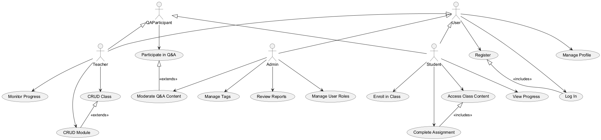
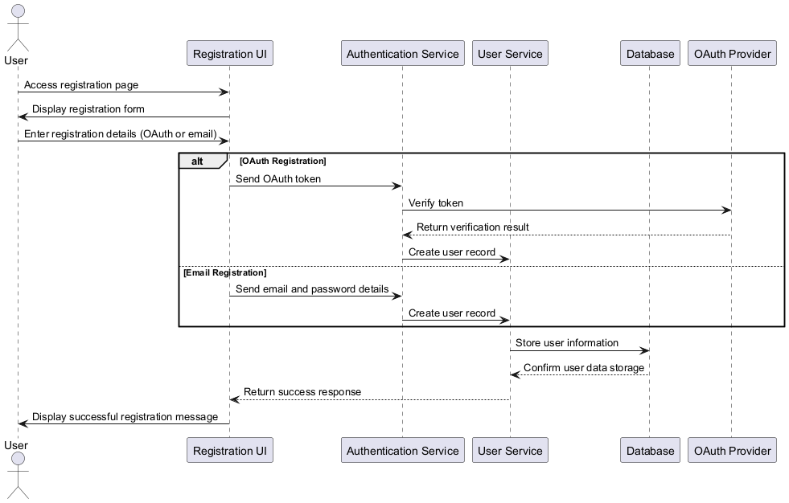
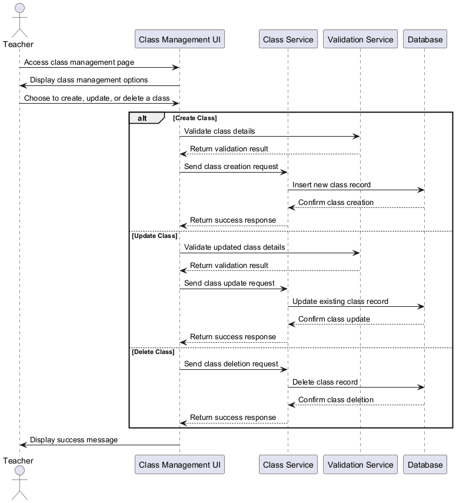
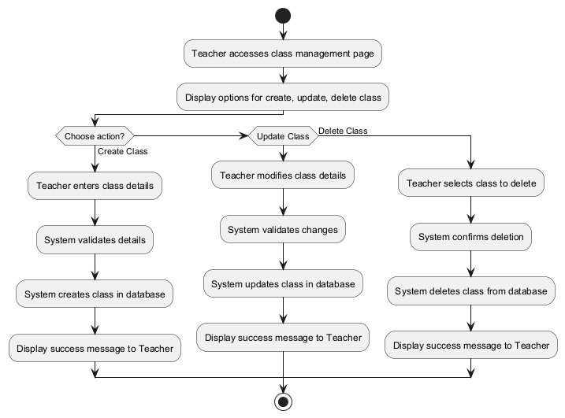
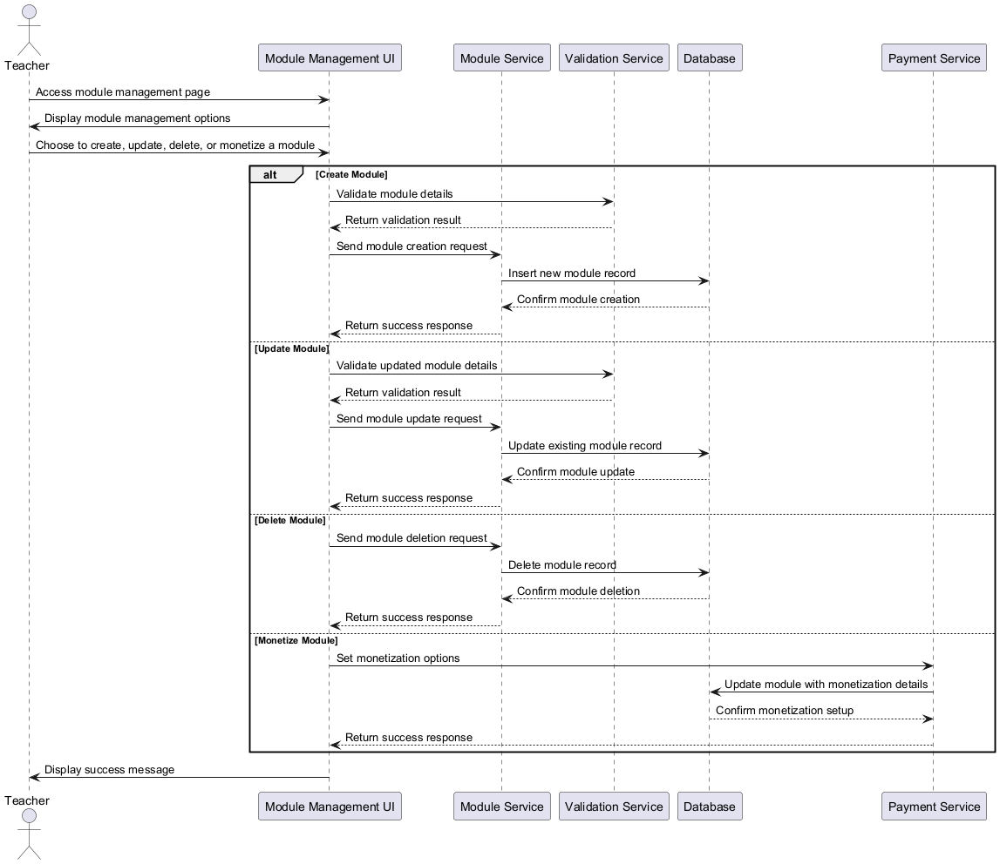
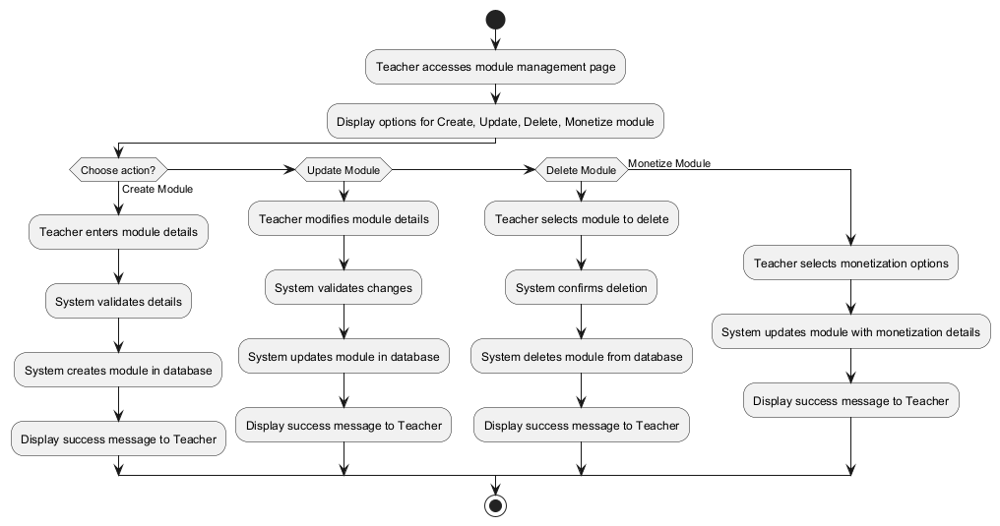
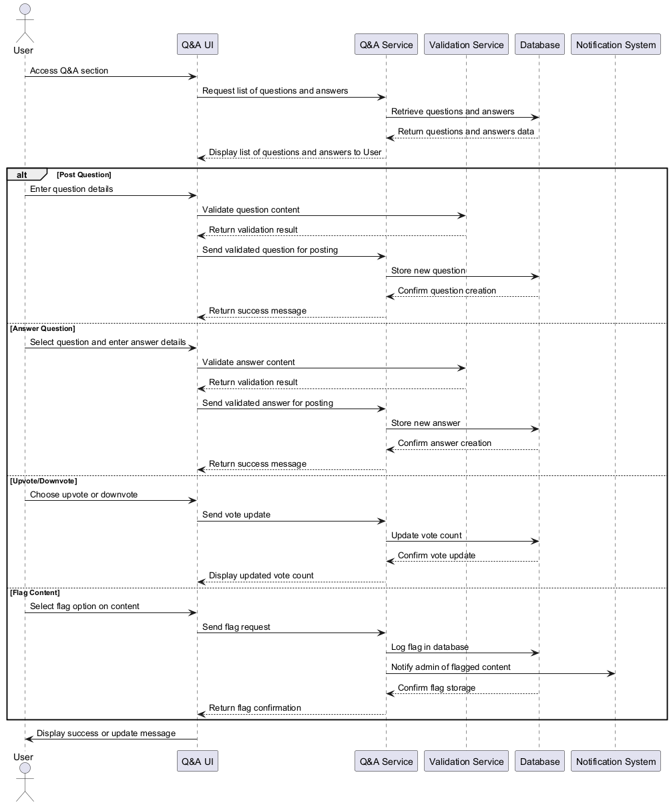
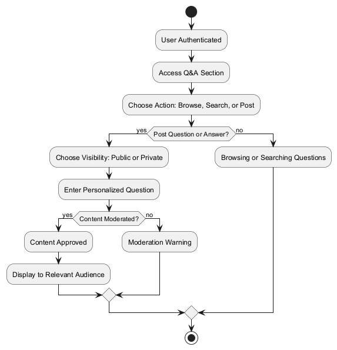
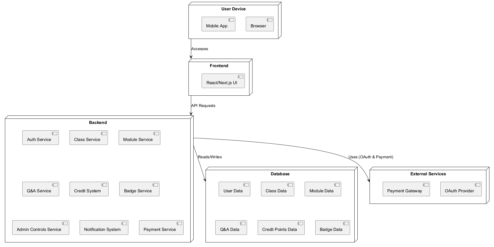
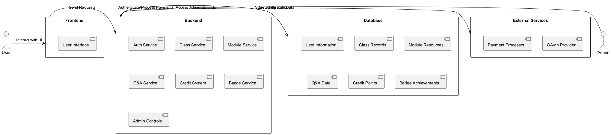

# Software Requirements Specification (SRS) for JAMC Project

## 1. Introduction

### 1.1 Purpose

The purpose of this document is to specify the detailed functional and non-functional requirements for the JAMC project, an online educational platform designed to support personalized learning for students in Vietnam’s high school system. This SRS outlines the system's capabilities, ensuring alignment between development and project goals for stakeholders, developers, and testers.

### 1.2 Scope

The JAMC project offers tools for managing real-world classes, a Q&A-based interactive learning system, self-paced Modules for additional learning resources, and a credit-based engagement system for students. This document specifies requirements for each user role, core features, and technical constraints. AI-based functions are reserved for future releases.

### 1.3 Definitions, Acronyms, and Abbreviations

- **JAMC**: Just A Minor Change project
- **CRUD**: Create, Read, Update, Delete
- **UI**: User Interface
- **MVP**: Minimum Viable Product
- **OAuth**: Open Authorization standard for secure user authentication
- **Q&A**: Questions and Answers subsystem
- **Class**: Real classroom setting where teachers interact with enrolled students.
- **Module**: Packaged learning resources or materials that can be accessed independently, monetizable for students outside of the Class.

## 2. Overall Description

### 2.1 Product Perspective

The JAMC project is a standalone web-based platform supporting teachers and enhancing the learning experience for students. Designed with **Next.js** as a fullstack framework, the platform leverages cloud services for scalability. Future enhancements may include AI-driven features, such as automated content moderation and personalized recommendations.

### 2.2 Product Features

- **Class Management**: Teachers create and manage real classes, track student progress, and provide feedback.
- **Module Access and Monetization**: Teachers create Modules as self-paced resources accessible to enrolled students and monetizable for others.
- **Q&A System**: Interactive Q&A enables students to ask questions, receive feedback, and engage based on individual needs.
- **Credit Points System**: Students earn credit points and badges for Q&A participation and completion of class and module tasks.

### 2.3 User Classes and Characteristics

- **Teacher**: Manages Classes and Modules, oversees student progress, and participates in Q&A.
- **Student**: Enrolls in Classes, accesses Modules, participates in Q&A, and earns engagement-based rewards.
- **Admin**: Oversees platform-wide settings, moderates Q&A content, and manages tags and flagged content.

### 2.4 Operating Environment

- **Frontend/Backend**: Next.js fullstack framework
- **Database**: PostgreSQL
- **Deployment**: Cloud-based for scalability and performance

### 2.5 Design and Implementation Constraints

- **Next.js** for frontend/backend integration
- Compliance with data privacy regulations (e.g., GDPR)
- Adapts to evolving educational content requirements

### 2.6 Assumptions and Dependencies

- Users will prefer OAuth for ease of registration; email is also supported.
- Teachers are familiar with digital tools for managing Classes and Modules.
- Platform relies on cloud infrastructure for high availability and scalability.

## 3. Functional Requirements

### 3.1 Use Case Diagram

### 3.2 Core Functionalities

#### 3.2.1 Registration

- **Actors**: Teacher, Student
- **Preconditions**: None
- **Description**: Users register using OAuth or email, with user roles defined during onboarding.
- **Postconditions**: Users have unique profile IDs.
- **Exceptions**: Errors for duplicate emails or OAuth failures.

#### Sequence Diagram

#### 3.2.2 Class Management

- **Actors**: Teacher
- **Preconditions**: Teacher is authenticated.
- **Description**: Teachers create Classes with names, schedules, and objectives. Students enroll based on class codes or invitations.
- **Postconditions**: Class is available for enrollment.
- **Exceptions**: Validation errors for incomplete Class details.

#### Sequence Diagram

#### Activity Diagram

#### 3.2.3 Module Management

- **Actors**: Teacher
- **Preconditions**: Teacher is authenticated.
- **Description**: Teachers create Modules with resources like videos, quizzes, and documents. They can set Modules as free or monetized for students outside the Class.
- **Postconditions**: Modules are accessible for enrolled students and visible for purchase if monetized.
- **Exceptions**: Upload errors or incomplete resource details.

#### Sequence Diagram

#### Activity Diagram

#### 3.2.4 Q&A Participation

- **Actors**: Student, Teacher
- **Preconditions**: Users are authenticated and enrolled in a Class.
- **Description**: Students ask questions in Q&A. Teachers can answer, upvote, or downvote, with visibility controls (public/private).
- **Postconditions**: Q&A is updated with new questions or answers.
- **Exceptions**: Content flagged for moderation.

#### Sequence Diagram

#### Activity Diagram

#### 3.2.5 Credit Points and Badge System

- **Actors**: Student
- **Preconditions**: Student is enrolled in a Class or Module.
- **Description**: Students earn credit points for participation in Q&A, completing Modules, and other activities.
- **Postconditions**: Credit points and badges are updated on the student’s profile.
- **Exceptions**: Points deducted for downvotes or inappropriate activity.

#### 3.2.6 Admin Controls

- **Actors**: Admin
- **Preconditions**: Admin is authenticated.
- **Description**: Admins manage platform-wide settings, moderate flagged Q&A content, and control tag creation.
- **Postconditions**: Platform quality is maintained with consistent moderation.
- **Exceptions**: Permissions errors or flagged content remains unresolved.

## 4. Non-Functional Requirements

### 4.1 Performance

- Ensure smooth concurrent access with minimal latency, especially during school hours.

### 4.2 Security

- OAuth preferred for authentication.
- TLS encryption for sensitive data transfers.
- Role-based access control (RBAC) across API endpoints.

### 4.3 Usability

- User-friendly interface with accessibility support for various digital literacy levels.

### 4.4 Reliability

- High availability (99.5% uptime) with regular data backups.

### 4.5 Supportability

- Optimized for major browsers and mobile devices, with maintainable codebase.

## 5. System Diagrams

### 5.1 System Architecture Diagram

### 5.2 Data Flow Diagram (DFD)

## 6. Other Requirements

### 6.1 Data Privacy & Localization

- Compliance with Vietnamese data protection laws and GDPR.
- Dual-language support (Vietnamese, English).

### 6.2 User Incentives

- **Credit Points**: Rewarded for engagement in Q&A and Module completion.
- **Badges**: Awarded for milestones in participation and achievements.

## 7. Appendices

### 7.1 Glossary

- **OAuth**: Authentication using third-party accounts.
- **Q&A**: Subsystem for question and answer interactions.
- **Class**: Real classroom setting where students interact with teachers.
- **Module**: Packaged learning materials accessible to students outside a class setting.
