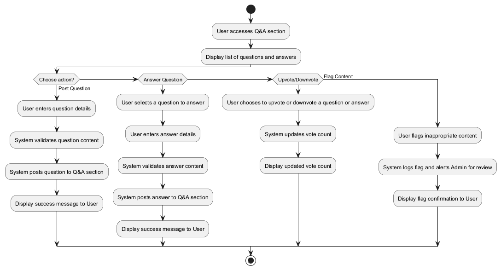

# Software Requirements Specification (SRS) for JAMC Project

## 1. Introduction

### 1.1 Purpose

The purpose of this document is to specify the detailed functional and non-functional requirements for the JAMC project, a comprehensive online platform primarily focused on supporting personalized learning experiences for students in Vietnam’s high school education system. This SRS outlines the system's capabilities, ensuring alignment between development and the project’s goals for stakeholders, developers, and testers.

### 1.2 Scope

The JAMC project includes features for managing high school classes, a personalized Q&A system for interactive learning, self-paced educational resources, and a student-centered engagement system. This document specifies requirements for each role, core features, and technical constraints. AI-related functions are reserved for future enhancements.

### 1.3 Definitions, Acronyms, and Abbreviations

- **JAMC**: Just A Minor Change project
- **CRUD**: Create, Read, Update, Delete
- **UI**: User Interface
- **MVP**: Minimum Viable Product
- **OAuth**: Open Authorization standard for secure user authentication
- **Q&A**: Questions and Answers subsystem

## 2. Overall Description

### 2.1 Product Perspective

The JAMC project is a standalone web-based platform designed to support teachers and enhance the learning experience for students. It focuses on creating a personalized and self-paced learning environment. The platform utilizes **Next.js** as a fullstack framework for both frontend and backend, with cloud service providers managing scalability. AI-related features, such as adaptive content moderation, are planned for future releases but are not part of the MVP.

### 2.2 Product Features

- **Class Creation & Management**: Teachers can create and manage classes, track individual student progress, and provide tailored feedback.
- **Student Enrollment**: Students can enroll using a unique class code or directly through teacher invitations.
- **Personalized Q&A System**: A dynamic system that allows students to ask personalized questions, get feedback, and learn according to their own pace.
- **Educational Resource Repository**: A centralized library for teachers to create and share self-paced learning materials.
- **Review System**: A feedback mechanism for students to evaluate teachers based on their learning experiences.

### 2.3 User Classes and Characteristics

- **Teacher**: Creates classes, manages students, monitors individual progress, and supports personalized Q&A.
- **Student**: Enrolls in classes, asks and answers personalized questions, accesses self-paced learning resources.
- **Admin** (future): Oversees platform-wide settings and moderates content.

### 2.4 Operating Environment

- **Frontend/Backend**: Next.js fullstack framework.
- **Database**: Managed through PostgreSQL.
- **Deployment**: Cloud infrastructure to handle scalability and provide a high-performance learning environment.

### 2.5 Design and Implementation Constraints

- **Next.js** must handle both frontend and backend functionalities.
- Data processing should comply with data privacy regulations (e.g., GDPR).
- The system should be adaptable to changing educational content and curriculum requirements.

### 2.6 Assumptions and Dependencies

- Users will prefer OAuth for registration due to ease of access; email registration is also supported.
- Teachers are familiar with digital tools for managing personalized learning.
- The system will rely on cloud providers for performance scalability and availability.

## 3. Functional Requirements

### 3.1 Use Case Diagram

### 3.2 Core Functionalities

#### 3.2.1 User Registration & Onboarding

##### Description

- **Actors**: Teacher, Student
- **Preconditions**: None
- **Description**: Users register via OAuth or email, with OAuth recommended. Onboarding adapts based on the user role.
- **Postconditions**: Users are added to the database with a unique profile ID.
- **Exceptions**: Registration errors if OAuth fails or if the email is already in use.

##### Sequence Diagram

#### 3.2.2 Class Creation & Management

##### Description

- **Actors**: Teacher
- **Preconditions**: Teacher is authenticated.
- **Description**: Teacher creates a class with name, schedule, and personalized learning resources. Track individual student progress and provide tailored support.
- **Postconditions**: Class is available for student enrollment, and learning progress is monitored.
- **Exceptions**: Validation errors for incomplete class details.

##### Sequence Diagram

##### Activity Diagram

#### 3.2.3 Personalized Q&A Participation

##### Description

- **Actors**: Student, Teacher
- **Preconditions**: User is authenticated and enrolled in the relevant class.
- **Description**: Users can ask personalized questions and receive tailored answers in the Q&A system. Visibility settings allow for public or private queries.
- **Postconditions**: Questions and answers are visible to all or specific class members based on visibility.
- **Exceptions**: Moderated content triggers warnings.

##### Sequence Diagram

##### Activity Diagram

#### 3.2.4 Educational Resource Access

##### Description

- **Actors**: Student, Teacher
- **Preconditions**: Teacher has created educational resources.
- **Description**: Teachers upload and share educational materials in a centralized repository, which students can access at their own pace.
- **Postconditions**: Resources are available for self-paced study.
- **Exceptions**: Content errors if resources fail to upload properly.

##### Sequence Diagram

##### Activity Diagram

## 4. Non-Functional Requirements

### 4.1 Performance Requirements

- The system should efficiently handle concurrent access by students and teachers, ensuring minimal latency.

### 4.2 Security Requirements

- **OAuth** is the preferred method for authentication.
- Data encryption (TLS) for all sensitive data transfers.
- Role-Based Access Control (RBAC) enforced at API endpoints.

### 4.3 Usability Requirements

- The interface must be user-friendly and support a diverse range of digital literacy skills, with a focus on facilitating personalized learning.

### 4.4 Reliability Requirements

- Cloud infrastructure to provide high availability, aiming for 99.5% uptime during school hours.
- Regular data backups for all user data to ensure information integrity.

### 4.5 Supportability Requirements

- The platform should be optimized for major browsers and mobile responsiveness.
- Maintainable codebase with adherence to clean coding standards, ensuring the system's long-term adaptability.

## 5. Other Requirements

### 5.1 Data Privacy & Localization

- Compliance with Vietnamese data protection laws and GDPR.
- Dual-language support for Vietnamese and English.

### 5.2 User Incentives & Personalized Feedback

- **Credit Points**: Earned through engagement in classes, assignments, and personalized Q&A participation.
- **Badges**: Achieved by reaching specific milestones (e.g., completing a course, asking quality questions).

## 6. Appendices

### 6.1 Glossary

- **OAuth**: A standard for user authentication using third-party accounts (e.g., Google, Facebook).
- **Q&A**: A subsystem for asking and answering questions within a class context.
- **Personalized Learning**: A student-centered approach that adapts to the pace and style of each student’s learning.
- **Educational Resource Repository**: A centralized collection of materials accessible by students at their own pace.

---

